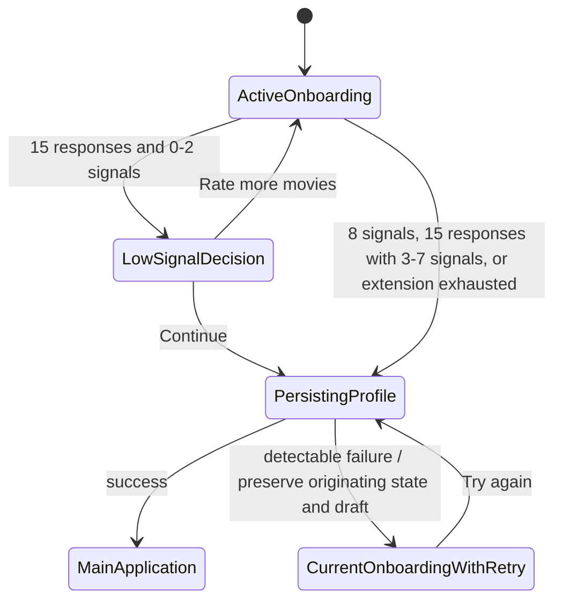
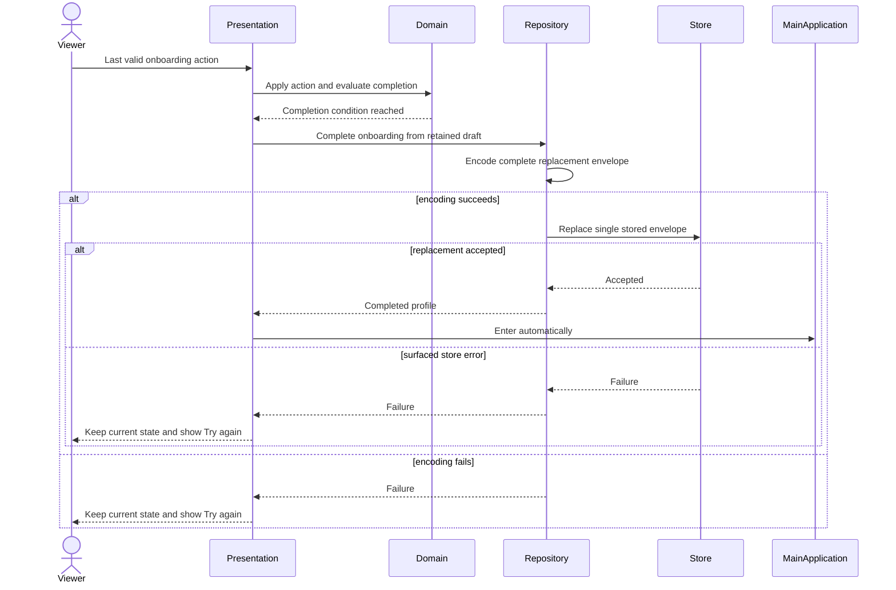

# Milestone 5 — Viewer Profile & Onboarding

## Status

Accepted — Ready for implementation

The Product Owner and CTO approved the catalog, localized-title behavior,
fifth `Settings` tab, persistence model, dynamic availability context, and
ADR-010 architecture on 2026-08-02. Milestone 4 was closed independently in
PR #19, this specification was updated onto that `develop` state, and the
resulting documents were confirmed conflict-free. Implementation belongs in a
new branch and PR after this specification PR is merged.

After physical-device validation on 2026-08-03, the Product Owner removed the
implementation-driven completion confirmation. The accepted flow now persists
the completed profile and enters the application automatically after the last
valid onboarding action.

## Identifiers

- Backlog: `IMP-019`
- Architecture:
  [ADR-010](../decisions/adr-010-local-viewer-profile-and-dynamic-context.md)
- Product authority: [`PRODUCT.md`](../../PRODUCT.md)
- Depends on: Milestone 4 availability contracts and ADR-009

## Goal

Create one reliable local source of viewer context for the Spain household
pilot. A first-time viewer selects at least one supported streaming service,
reacts to a small fixed movie catalog, and completes a resumable onboarding.
The resulting versioned profile immediately becomes the source of region and
service context for every new availability check and later supplies raw taste
signals to Milestone 6.

Milestone 5 captures and preserves context. It does not implement personalized
recommendations, scoring, `Three for Tonight`, or AI.

## User Outcome

The Product Owner can:

- complete onboarding without losing existing Watchlist or Search History;
- close and reopen the app during onboarding and continue from the saved point;
- choose the services currently available in Spain;
- provide useful taste signals without being forced to recognize every title;
- enter the current application automatically after the final valid onboarding
  action and successful profile persistence, without a redundant save
  confirmation or a false claim that Ask is personalized;
- edit services, repeat calibration, or reset only the viewer profile;
- observe that Movie Detail availability checks started after a service change
  use the newly selected services.

## Current Baseline

- The application opens directly into the four-tab `MainTabView`.
- There is no viewer profile, onboarding root state, or Preferences surface.
- Watchlist and Search History persist locally through `UserDefaultsLocalStore`.
- `CheckMovieAvailability` is created with immutable
  `AvailabilityViewingContext.spainPilot`, which selects all four pilot
  services for the lifetime of `AppContainer`.
- Availability evidence is cached in memory by movie ID and region, independent
  of service selection.
- The current Ask flow is a local stub and does not use viewer preferences.
- The repository uses Swift 6 strict concurrency and
  `Presentation → Domain ← Data`.

## Accepted Product Decisions

### Scope

Onboarding v1 contains only:

1. streaming-service selection;
2. title-based taste calibration.

Spain is visible and fixed. It does not receive a separate screen because the
viewer cannot change it.

Outside v1:

- name and avatar;
- account or authentication;
- manual genre selection;
- language or subtitle preferences;
- family and maturity constraints;
- household or partner profiles;
- country selection;
- plan-variant selection.

### Supported services

Show the following choices in this fixed order:

| Product name | TMDB provider ID | Initial state |
| --- | ---: | --- |
| Netflix | `8` | Not selected |
| Prime Video | `119` | Not selected |
| Disney+ | `337` | Not selected |
| Max | `1899` | Not selected |

Rules:

- at least one service is required;
- multiple services are allowed;
- no service is preselected;
- IDs and entitlement details are not shown;
- the fixed region appears in the same screen as
  `Availability region: Spain`;
- the Product Owner's known plan entitlements remain internal pilot mapping;
- rent, buy, store, and separately paid add-on behavior remains governed by
  `PRODUCT.md` and ADR-009.

### Calibration reactions

Use this exact English copy and semantic meaning:

| Reaction | Informative signal | Means watched | Meaning |
| --- | --- | --- | --- |
| `Love it` | Yes | Yes | Strong positive stable taste signal |
| `Like it` | Yes | Yes | Positive stable taste signal |
| `It was okay` | Yes | Yes | Neutral seen-movie signal; neither positive nor negative |
| `Didn't like it` | Yes | Yes | Negative stable taste signal |
| `Haven't seen it` | No | No | Recognized, but not watched |
| `Don't know it` | No | No | Movie is not identified |

Calibration never uses `Not for me`. It can conflate prior dislike, lack of
interest, and temporary viewing intent.

Every response is preserved by TMDB movie ID. Milestone 5 stores raw reactions,
but it does not persist a derived informative-signal count or translate
reactions into weights or a recommendation score. Domain calculates the count
as the number of `Love it`, `Like it`, `It was okay`, and `Didn't like it`
reactions.

Calibration does not add movies to Watchlist or its watched section. The raw
profile reaction preserves calibration-derived knowledge that the movie was
seen, but it is not a global definitive watched state. Watchlist and Movie
Detail may temporarily continue to show their existing independent state.
Milestone 6 must combine the four informative calibration reactions with the
existing Watchlist watched state when excluding prior viewing from Three for
Tonight. Milestone 5 does not create a global viewing history or synchronize
these surfaces.

### Completion rules

The catalog is fixed, ordered, versioned, and identified by TMDB movie IDs.

Normal flow:

1. Begin with the 12-title primary block.
2. After each reaction, persist the reaction and recalculate the derived
   informative count.
3. Finish calibration early as soon as eight informative signals are reached.
4. If the primary block is exhausted below eight, show reserve titles one at a
   time, up to 15 normal responses total.
5. After 15 responses:
   - three to seven informative signals complete the profile;
   - zero to two informative signals show the low-signal decision.

The low-signal decision offers:

- `Rate more movies`
- `Continue`

`Continue` completes the profile with its honest zero-to-two calculated signal
count.
Milestone 6 must treat that profile conservatively and must not claim strong
personalization.

`Rate more movies` presents the six-title optional extension in catalog order.
It ends when either:

- eight total informative signals are reached; or
- all six extension titles are answered.

At extension exhaustion, completion is allowed with any signal count. The
viewer is not trapped in onboarding.

Eight signals are a confidence target, never a mandatory completion gate.

When any accepted completion condition is reached, the application immediately
attempts to persist the completed profile. It does not present a
`Ready to save your preferences?` state, completion confirmation screen, or
`Save preferences` button. The user does not confirm a state the application
already knows.

The only explicit completion-related product decision is the low-signal choice
between `Rate more movies` and `Continue`. Choosing `Continue` starts automatic
persistence. Choosing `Rate more movies` enters the optional extension, which
starts automatic persistence when it later reaches eight signals or exhausts
its six titles.

## Calibration Catalog v1

### Review status

Approved for Milestone 5. All IDs, Spain-localized titles, English or original
titles, and years were verified against TMDB on 2026-08-02. The Product Owner
accepted the catalog membership, order, recognition, and early diversity.

Persist the catalog identifier as:

```text
es-household-calibration-v1
```

The order below is product behavior. An implementation must not shuffle,
replace, or remotely re-rank it.

The accepted first eight deliberately mix genre, pace, era, and tone and place
Spanish-language and Japanese titles before early completion can occur.

### Primary block — positions 1–12

| # | TMDB ID | Title known in Spain | Original or English title | Year | Original language | Deliberate coverage |
| ---: | ---: | --- | --- | ---: | --- | --- |
| 1 | `238` | El padrino | The Godfather | 1972 | English | classic, crime, slow prestige drama |
| 2 | `11036` | El diario de Noa | The Notebook | 2004 | English | romance, melodrama |
| 3 | `155` | El caballero oscuro | The Dark Knight | 2008 | English | superhero, action, crime, blockbuster |
| 4 | `1417` | El laberinto del fauno | Pan's Labyrinth | 2006 | Spanish | dark fantasy, war drama, Spanish-language cinema |
| 5 | `18785` | Resacón en Las Vegas | The Hangover | 2009 | English | broad comedy, irreverent tone |
| 6 | `129` | El viaje de Chihiro | Spirited Away | 2001 | Japanese | animation, family, fantasy, subtitled cinema |
| 7 | `157336` | Interstellar | Interstellar | 2014 | English | science fiction, emotional, long runtime |
| 8 | `419430` | Déjame salir | Get Out | 2017 | English | horror, social thriller |
| 9 | `496243` | Parásitos | Parasite | 2019 | Korean | thriller, dark comedy, contemporary international cinema |
| 10 | `354912` | Coco | Coco | 2017 | English | family animation, music, warm emotional tone |
| 11 | `546554` | Puñales por la espalda | Knives Out | 2019 | English | mystery, ensemble comedy, lighter suspense |
| 12 | `76341` | Mad Max: Furia en la carretera | Mad Max: Fury Road | 2015 | English | intense action, spectacle, fast pace |

### Normal reserve — positions 13–15

| # | TMDB ID | Title known in Spain | Original or English title | Year | Original language | Deliberate coverage |
| ---: | ---: | --- | --- | ---: | --- | --- |
| 13 | `120` | El señor de los anillos: La comunidad del anillo | The Lord of the Rings: The Fellowship of the Ring | 2001 | English | epic fantasy, adventure, long runtime |
| 14 | `313369` | La ciudad de las estrellas (La La Land) | La La Land | 2016 | English | musical, romance, bittersweet tone |
| 15 | `77338` | Intocable | The Intouchables | 2011 | French | feel-good comedy-drama, international cinema |

### Optional low-signal extension — positions 16–21

| # | TMDB ID | Title known in Spain | Original or English title | Year | Original language | Deliberate coverage |
| ---: | ---: | --- | --- | ---: | --- | --- |
| 16 | `278` | Cadena perpetua | The Shawshank Redemption | 1994 | English | hopeful prison drama, modern classic |
| 17 | `98` | Gladiator | Gladiator | 2000 | English | historical epic, action, tragedy |
| 18 | `194` | Amelie | Amélie | 2001 | French | whimsical romance, stylized international cinema |
| 19 | `120467` | El gran hotel Budapest | The Grand Budapest Hotel | 2014 | English | stylized comedy, eccentric tone |
| 20 | `447332` | Un lugar tranquilo | A Quiet Place | 2018 | English | suspense, horror, restrained dialogue |
| 21 | `906126` | La sociedad de la nieve | Society of the Snow | 2023 | Spanish | survival drama, history, recent Spanish-language cinema |

### Catalog delivery behavior

- Bundle the catalog identity, order, TMDB IDs, Spain-localized fallback
  titles, original or English fallback titles, and years with the application.
- TMDB with Spanish localization remains the primary metadata source for
  artwork and hydrated movie information.
- A poster failure shows a stable placeholder and does not prevent reacting.
- A metadata request failure still presents the bundled Spain-localized title
  followed by the bundled original or English title and year.
- A missing or invalid bundled catalog is a build-time/test failure, not a
  recoverable runtime catalog assembled from arbitrary TMDB content.
- Every ID is unique across primary, reserve, and extension blocks.
- The catalog version stored in a draft determines the order used when that
  draft resumes after an app update.
- A future catalog version does not silently reinterpret reactions collected
  under an earlier version.

## Onboarding Experience

### Root routing

At application launch, resolve persisted viewer state before presenting the
main tabs.

| State | Route |
| --- | --- |
| No completed profile and no draft | Start service selection |
| No completed profile and valid draft | Resume the saved onboarding step |
| Completed profile, no draft | Enter the main application |
| Completed profile plus recalibration draft | Enter the main application; Preferences offers `Continue calibration` |
| Unsupported stored version | Show explicit recovery; never reset silently |
| Corrupt stored data | Show explicit recovery; never reset silently |
| Detectable repository load error | Preserve stored bytes and show retry |

Initial onboarding is a root application state, not a dismissible sheet over
the tabs. A completed profile is required to reach the main application, but a
viewer may complete with zero signals after the accepted low-signal choice.

### Step 1 — Streaming services

Content:

- Title: `Streaming services`
- Secondary text: `Availability region: Spain`
- Supporting copy:
  `Choose the services where you can watch movies without paying extra.`
- Four service choices in accepted product order
- Primary action: `Continue`

Behavior:

- `Continue` is disabled while no service is selected.
- Every selection change is persisted to the draft.
- Internal provider IDs, plan names, TMDB, and JustWatch are not exposed in the
  selection controls.
- Relaunch returns with the saved selection intact.

### Step 2 — Taste calibration

Each card shows:

- artwork or a stable placeholder;
- when title forms differ, the title known in Spain as the primary title and
  the original or English title with release year as secondary context;
- when title forms are equivalent, one title with the release year rather than
  two visually duplicated lines;
- the six accepted reactions.

Presentation determines title equivalence by trimming surrounding whitespace,
collapsing repeated whitespace, and comparing without case sensitivity. It does
not remove punctuation or diacritics and does not attempt linguistic
normalization. Examples:

```text
Interstellar · 2014

El viaje de Chihiro
Spirited Away · 2001
```

Behavior:

- one reaction per title;
- selecting a reaction persists before advancing;
- Back returns to the prior title and permits replacing its reaction;
- replacing a reaction recalculates the Domain informative count from stored
  reactions;
- Back from the first title returns to service selection;
- previously answered titles and order survive relaunch;
- no passive impression, poster failure, or navigation action creates a
  reaction;
- the UI does not display an inferred score or taste label.

Milestone 5 may retain this instructional copy, which explains the confidence
target without acting as a progress indicator or promising a fixed denominator:

```text
8 taste signals help us start with more confidence.
```

### Low-signal decision

After the fifteenth normal response with zero to two signals:

- Title: `Want to rate a few more?`
- Body:
  `We can start broadly with what you have told us, or you can rate a few more movies first.`
- Primary action: `Rate more movies`
- Secondary action: `Continue`

Do not describe the profile as incomplete or invalid.

### Automatic completion

The application owns completion. After the last valid onboarding action:

1. retain the completed draft as the retry source;
2. attempt the whole-envelope completed-profile replacement immediately;
3. on success, enter the current application automatically;
4. on a detectable failure, remain in the current onboarding state, keep the
   completed draft, show retry UI, and never enter the application.

There is no success-confirmation screen and no user-facing save action.
Persistence remains invisible unless it fails, and success should feel
immediate. Automatic entry does not claim that Ask, the current Discovery feed,
or any existing recommendation is personalized. Milestones 5 and 6 remain
separate.

The following state flow is authoritative:



`CurrentOnboardingWithRetry` is the originating onboarding UI with local error
and retry presentation. It is not a new navigation or confirmation screen.

The corresponding persistence sequence is:



No progress indicator, animation, transition treatment, or new completion
feedback is defined by this change. A dedicated onboarding UX-polish milestone
will define those concerns later.

## Draft and Completed Profile Behavior

### Required completed-profile data

The persisted completed profile contains at minimum:

- `profileSchemaVersion`;
- `calibrationCatalogVersion`;
- region (`ES`);
- selected supported provider IDs;
- every calibration reaction keyed by TMDB movie ID.

The existence of `completedProfile` represents completed onboarding; no
redundant completion boolean is persisted. `informativeSignalCount` is a
calculated Domain property equal to the number of `Love it`, `Like it`,
`It was okay`, and `Didn't like it` reactions. It is never persisted in the
profile or validated against a stored counter. Milestone 6 consumes this
calculated value.

### Required draft variants

The envelope identifies the draft schema and stores one explicit draft variant.
The variants do not share a payload that can accidentally give recalibration
ownership of service selection.

A first-onboarding draft contains enough information to resume the whole flow:

- calibration catalog version;
- current user-facing onboarding step: service selection, calibration, or the
  low-signal decision;
- selected provider IDs;
- reactions keyed by TMDB movie ID;
- current catalog position;
- whether the optional extension has been accepted.

The first-onboarding draft has no persisted `readyToSave` or
completion-confirmation state. When completion is due, the same completed draft
data remains available for an automatic persistence retry.

A recalibration draft contains calibration state only:

- calibration catalog version;
- reactions keyed by TMDB movie ID;
- current catalog position;
- whether the optional extension has been accepted.

A recalibration draft contains neither region nor selected provider IDs. It
does not snapshot, copy, or own viewing context from the active profile.

Draft persistence rules:

- save every meaningful service-selection change to a first-onboarding draft;
- save every meaningful reaction change to the active draft variant;
- save the current onboarding step before first-onboarding navigation completes;
- retry a detectable encoding or repository write error without advancing;
- relaunch resumes the last successfully stored state;
- Back never discards saved answers;
- `Start over` deletes only the active draft and creates an empty draft of the
  same variant;
- starting first onboarding never modifies Watchlist or Search History.

### Atomic completion

Completing onboarding encodes one new completed profile and removes its draft
as one whole-envelope replacement. A detectable encoding failure or error from
an injected test double or future storage implementation leaves the previous
persisted state intact, keeps the current onboarding state visible and the
completed draft intact, and offers `Try again`. Successful replacement routes
directly into the application without a separate confirmation state.
The chosen `UserDefaults` implementation cannot claim confirmation that bytes
have been physically persisted after `set` returns.

During recalibration from Preferences, the existing completed profile remains
active until the replacement completes successfully. The recalibration draft
may coexist with it. Completion constructs the replacement profile from:

```text
region and selected services from the current active profile
+ reactions and catalog version from the recalibration draft
```

The active profile is read at completion time, so service changes made after
recalibration starts remain authoritative and cannot be overwritten by stale
draft data. Cancelling or resetting the recalibration draft preserves the
active profile.

## Preferences and Stable Navigation

### Stable entry

Add a fifth main tab:

- Label: `Settings`
- Symbol: `gearshape`

The Settings tab contains:

- a `Preferences` section;
- an `About` destination preserving TMDB and JustWatch attribution.

Move the current About entry from Discover into Settings so settings and legal
information do not remain tied to a surface that Milestone 6 will replace with
Home. The Settings tab survives the Discover-to-Home transition unchanged.

This decision deliberately avoids a profile tab: v1 has no identity, account,
avatar, or household-profile concept.

### Edit services

- Show Spain as fixed context.
- Show the same four services and ordering as onboarding.
- Require at least one selected service.
- Save as one serialized whole-envelope replacement.
- Every availability check started after successful save resolves the new
  context.
- An already-open Movie Detail does not update live.
- Fresh cached TMDB evidence remains reusable because the evidence cache is
  keyed by movie and region, not selected services.

### Repeat calibration

- Starts a new draft using the current accepted catalog version.
- Stores calibration state only; it never copies region or selected services.
- Does not replace or clear the active completed profile.
- Can resume from Preferences after interruption.
- Successful completion replaces reactions and catalog version as one complete
  envelope while taking region and services from the current active profile at
  completion time.
- A service edit made while recalibration is in progress remains authoritative
  and cannot be restored to an older value by completing the draft.
- Individual reaction editing is not available in v1.

### Reset profile draft

- Requires confirmation.
- Deletes only the draft.
- Preserves the completed profile, Watchlist, and Search History.
- During first onboarding, resetting returns to blank service selection.
- During recalibration, resetting returns to Settings with the active profile
  unchanged.

### Reset profile

- Requires confirmation.
- Deletes the completed profile and any profile draft.
- Never deletes Watchlist or Search History.
- Returns immediately to first onboarding.
- Does not clear availability evidence; evidence remains region-keyed and can
  be reevaluated after a new service selection.

Accepted confirmation copy:

- Title: `Reset preferences?`
- Body:
  `This removes your streaming services and movie calibration. Your Watchlist and Search History will stay.`
- Destructive action: `Reset preferences`
- Cancel action: `Cancel`

## Dynamic Availability Context

Every availability check resolves the current completed profile when the check
begins. The required Domain flow is equivalent to:

```text
ViewerProfileRepository
    → GetCurrentViewingContext
        → CheckMovieAvailability
            → AvailabilityRepository
```

Behavior:

- `AppContainer` no longer injects `.spainPilot` as immutable selected context.
- `CheckMovieAvailability` requests current context for every `execute` call.
- context resolution must complete before evidence evaluation;
- selected provider IDs are mapped only through the accepted allowlist;
- a check initiated after a successful Preferences save sees the new services;
- a check already in progress may finish using the context captured at its
  start;
- changing services does not invalidate fresh evidence;
- Domain reevaluates the same evidence against the new selection;
- a missing completed profile cannot be treated as all services selected;
- playback-options preparation uses the same dynamic check path and therefore
  cannot retain stale service selection.

Exact architecture is defined by accepted ADR-010.

## Persistence and Recovery

### Persisted states

Distinguish:

| Persisted condition | Product behavior |
| --- | --- |
| Profile absent | Start onboarding |
| Valid incomplete first-onboarding draft | Resume onboarding |
| Valid completed profile | Enter application |
| Valid profile plus recalibration draft | Enter application and offer resume in Settings |
| Unsupported version with no migrator | Explicit reset choice |
| Corrupt bytes or invalid invariant | Explicit reset choice |
| Detectable decoding or repository load error | Preserve data and offer retry |
| Detectable encoding or repository save error | Preserve the last complete envelope and offer retry |

The v1 `UserDefaults` implementation can detect encoding and decoding failures,
unsupported schemas, invalid invariants, and errors injected by a test double
or a future store that exposes failures. `UserDefaults.set` does not report
whether bytes have been physically persisted, so the product does not present
that unobservable condition as a distinct runtime state.

### Unsupported version

If no accepted migration exists:

- Title: `Preferences need to be reset`
- Body:
  `This saved preference version isn't supported by this build. Your Watchlist and Search History won't be affected.`
- Actions: `Reset preferences`, `Try again`

Do not attempt best-effort decoding into the current schema.

### Corrupt data

- Title: `Preferences couldn't be read`
- Body:
  `Your saved preferences are damaged. You can try again or reset them. Your Watchlist and Search History won't be affected.`
- Actions: `Try again`, `Reset preferences`

Corrupt bytes remain untouched until the viewer confirms reset.

### Detectable save failure

- remain on the current step;
- keep the in-memory selection or reaction visible;
- do not advance or claim completion;
- show a local error and `Try again`;
- retry the same whole-envelope operation;
- never reset the stored profile or draft as error recovery.

This behavior applies to encoding failures and errors explicitly surfaced by a
test double or future storage implementation. It does not claim detection of a
physical `UserDefaults` write failure that the API does not expose.

## Architecture

Milestone 5 preserves `Presentation → Domain ← Data` and follows ADR-010.

### Domain

Add focused values and contracts equivalent to:

- viewer profile, first-onboarding draft, and recalibration draft;
- calibration reaction and catalog identity;
- viewer-profile load/recovery state;
- `ViewerProfileRepository`;
- load/start/resume onboarding;
- save onboarding progress;
- complete onboarding;
- update service selection;
- begin/reset recalibration;
- reset viewer profile;
- get current viewing context.

Domain owns:

- reaction semantics and informative-count calculation;
- completion and low-signal rules;
- supported service and region validation;
- state transitions between each draft variant and completed profile;
- the invariant that recalibration owns no region or selected-service state;
- recalibration completion composition from the current active profile and the
  calibration-only draft;
- dynamic conversion from current profile to `AvailabilityViewingContext`;
- rules that preserve an active profile during recalibration.

Domain does not know about UserDefaults, JSON, SwiftUI, tab navigation, or
persisted DTOs.

### Data

Provide a dedicated local profile repository. Do not add viewer-profile methods
to `MovieRepository`, `AvailabilityRepository`, or the existing broad
`LocalStore` contract.

Data owns:

- persisted DTOs and schema decoding;
- one serialized state envelope capable of containing a completed profile and
  an optional tagged first-onboarding or recalibration draft;
- serialized whole-envelope replacement after complete encoding;
- schema migration dispatch;
- preservation of corrupt or unsupported bytes until explicit reset;
- mapping persisted values to validated Domain values.

The profile and draft must not be spread across independent UserDefaults keys
whose separate logical updates could produce a completed profile without its
reactions.

### Presentation

Add explicit states for:

- startup profile loading;
- service selection;
- calibration loading and reaction entry;
- low-signal choice;
- automatic completion persistence and retry on the current onboarding state;
- unsupported/corrupt recovery;
- Settings and recalibration.

Presentation talks only to profile and availability use cases. Views never
read UserDefaults, persisted DTOs, or provider IDs directly.
Presentation also owns calibration title display mapping, including suppression
of an equivalent secondary title after the accepted case-and-whitespace-only
comparison.

### Composition and concurrency

- The local profile repository has one serialized owner compatible with Swift
  6 strict concurrency.
- `AppContainer` creates one repository instance shared by profile use cases
  and dynamic availability-context resolution.
- No unchecked `Sendable` conformance is allowed.
- No service locator or global mutable profile singleton is introduced.
- View models remain `@MainActor` and guard cancellation and stale responses.

## In Scope

- fixed Spain region presentation;
- supported service selection with no defaults;
- accepted fixed versioned calibration catalog;
- resumable first-onboarding and recalibration drafts;
- serialized whole-envelope completed local profile;
- signal counting and low-signal exit;
- automatic completion without an intermediate confirmation screen;
- root routing and explicit recovery states;
- stable Settings entry, Preferences, and About relocation;
- service editing, full recalibration, draft reset, and profile reset;
- dynamic current-profile availability context;
- automated persistence, Domain, presentation, migration, and integration tests;
- physical upgrade validation on the pilot iPhone.

## Explicit Non-Goals

- implementation of Milestone 6 or changes to recommendation ranking;
- personalized Ask claims or behavior;
- TMDB Discover candidate generation;
- Home or `Three for Tonight`;
- weights, scoring, diversity, or recommendation reasons;
- accounts, authentication, sync, or multiple profiles;
- country or plan selectors;
- manual genres, languages, subtitle preferences, or maturity controls;
- individual reaction editing;
- modifying Watchlist or Search History from calibration;
- creating a global viewing history or synchronizing calibration reactions with
  Watchlist and Movie Detail watched state;
- analytics;
- backend or AI integration;
- persistent availability evidence;
- live refresh of a Movie Detail already open during service editing;
- localization of the general English UI beyond the accepted Spain-localized
  movie-title recognition treatment;
- broad navigation or persistence refactors outside the new Settings/profile
  boundary.

## Error and Cancellation Behavior

| Condition | Behavior |
| --- | --- |
| No service selected | `Continue` disabled |
| Draft encoding or surfaced repository write fails | Stay on current interaction and retry |
| App closes after persisted reaction | Resume after that reaction |
| App closes before failed reaction write | Resume before that reaction |
| Catalog artwork fails | Placeholder; reaction remains available |
| Metadata hydration fails | Bundled Spain-localized title, original or English title, and year fallback |
| Completion encoding or surfaced repository write fails | Keep the completed draft and active prior profile, remain on the current onboarding state, show retry, and never enter the application |
| First onboarding cancelled by process termination | Resume draft on launch |
| Recalibration interrupted | Active profile remains; resume from Settings |
| Stored profile unsupported | Recovery UI; no automatic reset |
| Stored data corrupt | Recovery UI; preserve bytes until confirmation |
| Profile reset confirmed | Remove profile/draft only; route to onboarding |
| Availability check has no completed profile | Typed context-unavailable result; never all services |
| Service save succeeds during existing availability request | Existing request may finish with captured context; next request uses new context |

Task cancellation is not corruption or a persistence failure. Cancelled work
publishes no false success or recovery state.

## Acceptance Criteria

### Onboarding and calibration

- a profileless install starts at service selection;
- Spain is visible without a separate region screen or selector;
- all four services use accepted names and order;
- none is preselected;
- at least one service is required;
- the six reactions use exact accepted copy and semantics;
- only the first four increment the calculated informative count;
- `It was okay` is informative and watched but neither positive nor negative;
- each first-four reaction records calibration-derived knowledge that the movie
  was seen without asserting a global watched state or
  mutating Watchlist;
- Milestone 6 combines informative calibration reactions and Watchlist watched
  state when excluding movies from Three for Tonight;
- the flow stops immediately at eight informative signals;
- reserve titles are used only when the primary block ends below eight;
- normal responses never exceed 15;
- three to seven signals complete after normal exhaustion;
- zero to two signals show `Rate more movies` and `Continue`;
- optional extension stops at eight signals or six additional answers;
- completion is possible after extension exhaustion with any count;
- reaching any accepted completion condition starts completed-profile
  persistence automatically;
- successful final persistence enters the application without a
  `Ready to save your preferences?` state, completion screen,
  `Save preferences` button, or additional user confirmation;
- the only explicit completion-related decision is `Rate more movies` or
  `Continue` after 15 responses with zero to two signals;
- this milestone does not add a progress indicator, animation, transition, or
  completion-feedback treatment;
- informative count is calculated from reactions and is absent from persisted
  profile and draft data;
- each card presents distinct title forms as title known in Spain, then original
  or English title and year;
- equivalent title forms are shown once with the year after a case-insensitive
  comparison that trims and collapses whitespace;
- punctuation and diacritics remain significant and no linguistic title
  normalization occurs;
- hydration failure retains the same recognition fields from bundled fallback
  metadata;
- at least one Spanish-language or clearly international movie appears before
  early completion can occur;
- no copy claims current Ask or Discovery is personalized.

### Draft and persistence

- progress persists after every service or reaction change;
- Back preserves and can revise reactions;
- relaunch resumes first onboarding at the saved position;
- a first-onboarding draft owns selected services and full onboarding progress;
- a recalibration draft owns only catalog version, reactions, catalog position,
  and extension state, with no region or selected services;
- an envelope containing a completed profile plus first-onboarding draft, or a
  recalibration draft without a completed profile, is invalid and is not
  silently reinterpreted;
- completion encodes the full replacement envelope before replacing its single
  stored value;
- a detectable failed completion preserves the completed draft, remains on the
  current onboarding state with retry UI, and never enters the application;
- a recalibration draft coexists with the active profile;
- recalibration completion takes region and selected services from the current
  active profile and calibration data from the draft;
- changing services during recalibration cannot be undone by completing that
  recalibration;
- an interrupted recalibration does not affect current availability context;
- a future app build can decode the accepted v1 profile;
- unsupported and corrupt data remain distinct and are never silently reset;
- resetting a draft does not delete a completed profile;
- resetting a profile deletes neither Watchlist nor Search History.

### Preferences and navigation

- Settings remains available independently of Discover;
- About attribution remains reachable after relocation;
- service editing requires one selection and replaces one complete envelope;
- repeating calibration replaces reactions only after successful completion;
- individual reaction editing is absent;
- reset confirmation describes exactly what is and is not deleted.

### Dynamic availability

- `CheckMovieAvailability` no longer stores immutable `.spainPilot` context;
- every execution resolves a current context from the profile repository;
- a check after service save uses the saved selection;
- fresh cached evidence is reevaluated without an unnecessary TMDB request;
- changing services cannot make an unselected provider eligible;
- Movie Detail already open during editing need not update live;
- handoff revalidation uses current service context;
- missing, corrupt, or unsupported profile cannot fall back to all services.

### Regression

- existing Watchlist and Search History survive upgrade, onboarding, draft
  reset, profile reset, and later app update;
- Discovery, Search, Ask, Watchlist, Detail, availability, and About remain
  usable after onboarding;
- strict Swift 6 concurrency remains warning-free;
- no TMDB credential or viewer data is logged or committed.

## Required Automated Tests

At minimum:

1. catalog uniqueness, order, block sizes, version, localized and original or
   English fallback metadata, first-eight diversity, and accepted TMDB IDs;
2. reaction semantic mapping and informative-count calculation, including the
   neutral watched semantics of `It was okay` and the absence of a persisted
   counter;
3. primary, reserve, early-eight, three-to-seven, zero-to-two, Continue,
   optional-extension, and automatic-completion state transitions, including
   the absence of a confirmation state or save button;
4. first-onboarding and recalibration draft save, Back revision, tagged variant
   decoding, and deterministic resume;
5. first completion and recalibration serialized whole-envelope replacement,
   using one key and persisted DTOs with neither a signal counter nor a
   redundant completion boolean;
6. active-profile preservation during recalibration and failed completion;
   recalibration DTOs contain no region or selected services, completion reads
   both from the current active profile, and a concurrent service edit cannot
   be restored to an older selection;
7. absent, valid, unsupported, corrupt, encoding, decoding, and injected
   repository-error outcomes;
8. reset-draft and reset-profile isolation from Watchlist/Search History;
9. root routing for every persisted state;
10. exact service, low-signal, reset, recovery, and completion-retry copy, plus
    the absence of obsolete completion-confirmation copy;
11. Preferences service validation, full recalibration, and reset confirmation;
12. current-context resolution on every availability execution;
13. fresh evidence reuse after service changes without another client request;
14. current services applied during stale handoff revalidation;
15. cancellation and stale-response protection in onboarding and Preferences
    view models;
16. Settings and About navigation accessibility.
17. all four informative reactions expose calibration-derived seen semantics
    while calibration persistence leaves Watchlist and Movie Detail state
    unchanged.
18. title presentation shows one `Title · Year` line for forms equivalent after
    case and whitespace normalization, two lines for distinct forms, and uses
    the same rule for hydrated and bundled fallback metadata.

Repository tests verify only observable contracts. They must not simulate a
generic physical `UserDefaults` durability acknowledgement that the production
API does not provide.

Tests must not use live TMDB requests, actual UserDefaults standard storage,
wall-clock waiting, Safari, or a real credential. Use isolated suites and
deterministic doubles.

## Required Validation

Before handoff, run:

```text
make verify
```

The implementation PR must also demonstrate:

- CI green on the final commit;
- no formatting or lint bypass;
- no committed credentials or raw viewer data;
- an upgrade-oriented physical-device validation record.

## Physical-Device Validation

On the pilot iPhone:

1. Install over the existing build.
2. Confirm existing Watchlist and Search History remain present.
3. Confirm onboarding appears once when no profile exists.
4. Select services, react to several titles, terminate the app, relaunch, and
   confirm exact progress resumes.
5. Trigger an accepted completion condition and confirm the application enters
   automatically after successful persistence, without a confirmation screen
   or save button; confirm subsequent launches do not show first onboarding
   again.
6. Confirm the automatic transition does not claim Ask is personalized.
7. Open Detail and record availability for a title.
8. Change services in Settings, start a new Detail availability check, and
   confirm the new service context is used.
9. Begin recalibration, terminate the app, and confirm it can resume without
   replacing the active profile.
10. Reset a recalibration draft and confirm the active profile remains.
11. Reset the profile and confirm Watchlist and Search History remain.
12. Complete onboarding again.
13. Install a later build over it and confirm the profile remains readable and
    onboarding does not reappear.
14. Smoke-test Discovery, Search, Ask, Watchlist, Detail, availability handoff,
    Settings, and About.

The implementation PR remains open until this validation is recorded. Its
final documentation commit closes Milestone 5, updates roadmap and backlog
status, and records any accepted deviations before merge.

## Rollout and Compatibility

- Absence of profile intentionally gates the main tabs behind onboarding.
- Existing Watchlist and Search History formats remain unchanged.
- No migration of those stores is authorized.
- The first profile schema starts at v1 with explicit future migration routing.
- A completed profile is local to one installation.
- Removing Milestone 5 may leave an ignored profile envelope but must not make
  existing stored features unreadable.

## Privacy and Security

- Profile and reactions remain on device.
- Do not log reaction maps, selected services as user telemetry, stored bytes,
  or persistence errors containing payloads.
- Do not add analytics or transmit calibration reactions to TMDB.
- TMDB receives only movie metadata requests already within the accepted API
  boundary.
- Never include the TMDB credential in catalog data, tests, logs, fixtures, or
  PR text.
- Reset affects only the explicitly described local profile state.

## Implementation Order

Implementation starts only from a new branch and PR after this documentation
PR is merged:

1. Add Domain profile, draft, reaction, catalog, state, and repository contracts.
2. Add deterministic catalog and calibration state-machine tests.
3. Implement the single-envelope local repository and recovery tests.
4. Implement onboarding use cases and serialized whole-envelope
   completion/recalibration.
5. Replace immutable availability context with current-profile resolution.
6. Add root routing and resumable onboarding presentation.
7. Add Settings, Preferences, reset flows, and About relocation.
8. Complete concurrency, cancellation, regression, and accessibility tests.
9. Run `make verify`, CI, and physical-device validation.
10. Close milestone documentation in the same implementation PR before merge.

## Agent Constraints

The future implementation agent must:

- treat `PRODUCT.md`, this accepted specification, ADR-010, ADR-009, and
  `AGENTS.md` as authoritative;
- use a separate feature branch and PR;
- use only `Cesar-IA-Agent` for commit and GitHub writes;
- preserve Swift 6 strict concurrency without unchecked sendability;
- use the accepted catalog exactly;
- keep M5 separate from M6;
- make no scoring, personalization-strength, navigation, persistence, or copy
  decision beyond the accepted documents;
- stop if implementation reveals an unsupported profile state or atomicity
  conflict not covered here;
- leave the PR open through device validation and close the milestone in that
  same PR before merge.

## Acceptance Record

The Product Owner and CTO accepted the product and architecture decisions on
2026-08-02. The remaining documentary prerequisites are also complete:

1. the isolated Milestone 4 documentary closure was merged in PR #19;
2. PR #18 was updated onto the resulting `develop` state;
3. the Milestone 4 completion record, ADR-009 boundary, and this specification
   were checked and introduce no conflict;
4. Milestone 5, ADR-010, roadmap, backlog, and PR description were moved to the
   accepted state together.
5. The automatic-completion amendment was accepted after physical-device
   validation on 2026-08-03. This amendment is documentation-only and does not
   authorize unrelated production changes.

Acceptance makes the specification executable. It does not add production code
to PR #18; Milestone 5 implementation remains a separate delivery task.
